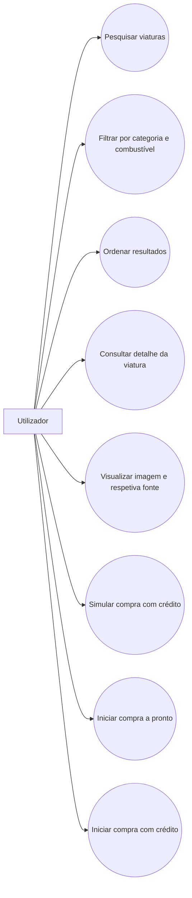
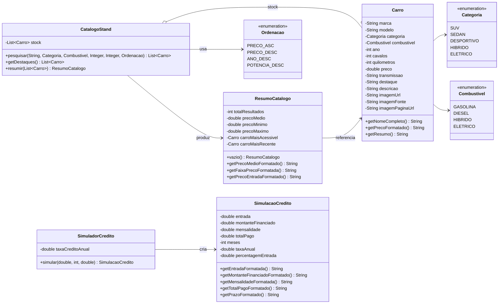
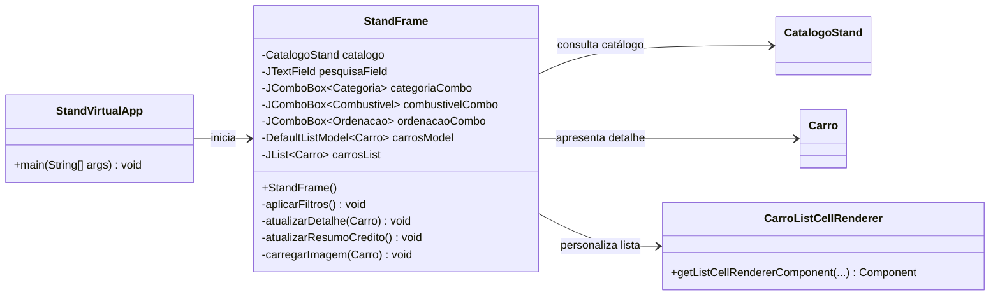

# Relatório de Projeto: StandVirtual Premium

## 1. Introdução

O presente relatório descreve o desenvolvimento do **StandVirtual Premium**, uma aplicação desktop implementada em Java com recurso à biblioteca **Swing**, concebida para simular a experiência de consulta de um catálogo automóvel digital. A solução permite ao utilizador pesquisar, filtrar, ordenar e analisar viaturas, bem como visualizar informação comercial detalhada e obter uma estimativa simplificada de financiamento.

Este documento tem como objetivo apresentar, de forma estruturada e rigorosa, o enquadramento do projeto, os seus requisitos, a modelação do domínio, a organização interna do código e as principais decisões de implementação. Para além da componente funcional, procura-se igualmente evidenciar a aplicação de princípios de **Programação Orientada a Objetos**, a separação de responsabilidades entre camadas e a construção de uma interface gráfica coerente com o propósito do sistema.

Importa salientar que a versão atual do projeto já não corresponde ao contexto de um jogo bidimensional, anteriormente refletido no relatório legado existente no repositório. Consequentemente, o conteúdo foi integralmente adaptado ao estado real da aplicação, preservando, no entanto, a estrutura formal do modelo de relatório originalmente solicitado.

## 2. Análise de Contexto

O setor automóvel tem vindo a adotar, de forma crescente, soluções digitais de apoio à exposição comercial de viaturas. Mesmo em ambientes académicos ou demonstrativos, um showroom virtual constitui um caso de estudo relevante, pois combina problemas de interface, modelação de entidades, filtragem de informação, tratamento de dados formatados e integração de conteúdos multimédia.

Neste contexto, o **StandVirtual Premium** foi concebido como uma aplicação autónoma, sem dependência de base de dados externa, apta a demonstrar um fluxo de utilização típico de um catálogo automóvel:

* exploração de uma lista de viaturas;
* aplicação de critérios de pesquisa e filtragem;
* consulta de detalhe técnico e comercial;
* simulação elementar de compra com crédito.

Do ponto de vista pedagógico, o projeto revela-se particularmente pertinente, na medida em que permite observar a articulação entre:

* classes de domínio simples e imutáveis;
* enums para categorização de dados;
* serviços de pesquisa e cálculo;
* componentes gráficos especializados para apresentação de resultados.

Em termos tecnológicos, a solução foi desenvolvida com foco na simplicidade de execução, portabilidade e clareza arquitetural, valorizando a separação entre **modelo**, **serviços** e **interface gráfica**.

## 3. Requisitos

### Requisitos Funcionais

* O sistema deve apresentar uma janela principal com o catálogo de viaturas disponível.
* O sistema deve permitir a pesquisa textual de viaturas por marca, modelo, descrição ou destaque comercial.
* O sistema deve permitir a filtragem do catálogo por categoria.
* O sistema deve permitir a filtragem do catálogo por tipo de combustível.
* O sistema deve permitir a ordenação dos resultados por preço crescente, preço decrescente, ano ou potência.
* O sistema deve atualizar dinamicamente a lista de resultados de acordo com os filtros aplicados.
* O sistema deve apresentar o detalhe completo da viatura selecionada, incluindo nome, preço, características técnicas e descrição comercial.
* O sistema deve carregar a imagem associada à viatura, privilegiando recursos locais e recorrendo a fontes online como mecanismo alternativo.
* O sistema deve permitir abrir a página de origem da imagem, quando essa informação se encontra disponível.
* O sistema deve disponibilizar uma simulação básica de crédito automóvel, em função do preço da viatura e do prazo selecionado.
* O sistema deve permitir iniciar ações de compra a pronto ou compra com crédito, comunicando o resultado através de caixas de diálogo informativas.

### Requisitos Não Funcionais

* O projeto deve ser compatível com **JDK 8 ou superior**.
* A interface gráfica deve ser implementada com **Java Swing**.
* O código deve apresentar organização modular, com separação entre pacotes de domínio, serviços e interface.
* A aplicação deve privilegiar legibilidade, manutenibilidade e consistência nomenclatural.
* A pesquisa deve responder de forma rápida e estável à interação do utilizador.
* Os valores numéricos e monetários devem ser apresentados segundo convenções adequadas ao contexto `pt-PT`.
* O sistema deve funcionar sem necessidade de configuração externa complexa.

## 4. Diagramas de Casos de Uso

O ator principal da aplicação é o **Utilizador**, entendido como o cliente final, operador comercial ou avaliador académico que interage com o showroom digital. O diagrama seguinte sintetiza os casos de uso essenciais do sistema:

O diagrama evidencia que a aplicação não se limita à simples apresentação de uma lista de veículos: existe igualmente uma componente de apoio à decisão, traduzida na consulta de detalhe e na simulação elementar de compra.

## 5. User Stories

1. **Como** utilizador, **quero** pesquisar viaturas por texto livre **para** localizar rapidamente os modelos relevantes para a minha necessidade.
2. **Como** utilizador, **quero** aplicar filtros por categoria e combustível **para** restringir o catálogo a opções compatíveis com as minhas preferências.
3. **Como** utilizador, **quero** ordenar os resultados por critérios objetivos **para** comparar melhor as alternativas disponíveis.
4. **Como** utilizador, **quero** consultar a ficha detalhada de cada viatura **para** compreender as suas características técnicas e comerciais.
5. **Como** potencial comprador, **quero** visualizar uma simulação de crédito **para** obter uma estimativa inicial do esforço financeiro associado à aquisição.
6. **Como** utilizador em contexto de demonstração, **quero** poder iniciar uma compra a pronto ou com crédito **para** validar o comportamento comercial previsto pela interface.

## 6. Análise de Domínio / Modelo Entidade-Relação

Embora o projeto não recorra a uma base de dados relacional, a análise do domínio continua a ser necessária, uma vez que a informação tratada pela aplicação assenta num conjunto coerente de entidades e relações lógicas. A entidade central do sistema é `Carro`, complementada por tipos enumerados (`Categoria` e `Combustivel`) e por serviços responsáveis pela pesquisa, sumarização e simulação financeira.

### 6.1. Diagrama de Classes do Domínio e Serviços

O diagrama anterior evidencia que o domínio foi modelado de forma simples, porém suficiente para suportar a lógica da aplicação. A classe `Carro` agrega a informação necessária para apresentação e filtragem, enquanto `CatalogoStand` centraliza a lógica de pesquisa. Já `ResumoCatalogo` e o par `SimuladorCredito` / `SimulacaoCredito` representam serviços especializados passíveis de reutilização noutros contextos.

### 6.2. Diagrama de Classes da Interface e Arranque

Esta segunda perspetiva destaca a camada de apresentação. A classe `StandVirtualApp` atua como ponto de entrada da aplicação, enquanto `StandFrame` concentra a composição da interface, a gestão de eventos e a atualização do estado visual. O componente `CarroListCellRenderer` foi introduzido para personalizar a apresentação dos elementos da lista, contribuindo para uma experiência visual mais consistente.

É ainda relevante assinalar que as classes `ResumoCatalogo`, `SimuladorCredito` e `SimulacaoCredito` já integram a arquitetura do projeto. Todavia, na versão atual da interface, o cálculo da simulação de crédito é efetuado localmente em `StandFrame`, pelo que essas classes se encontram prontas para integração mais completa numa evolução posterior do sistema.

## 7. Análise da Estrutura do Projeto

O projeto encontra-se organizado em quatro áreas funcionais principais:

* `standvirtual`: contém a classe de arranque da aplicação;
* `standvirtual.model`: reúne as entidades do domínio e os respetivos tipos enumerados;
* `standvirtual.service`: agrega serviços de pesquisa, resumo e cálculo;
* `standvirtual.ui`: concentra a interface gráfica e os componentes de apresentação.

Esta organização traduz uma arquitetura de pequena escala, mas adequada ao objetivo do projeto, uma vez que isola a lógica de domínio da lógica visual e favorece a manutenção incremental do código.

### Aplicação de Programação Orientada a Objetos

No contexto da Programação Orientada a Objetos, o projeto apresenta vários aspetos dignos de destaque:

* **Encapsulamento**: as classes `Carro`, `ResumoCatalogo` e `SimulacaoCredito` definem os seus atributos como `private final`, expondo apenas métodos de consulta e formatação. Esta decisão protege a integridade do estado interno dos objetos.
* **Abstração**: a lógica de pesquisa e tratamento do catálogo é encapsulada em `CatalogoStand`, permitindo que a interface gráfica consuma apenas operações de alto nível, sem depender da implementação concreta do armazenamento.
* **Herança**: a herança surge sobretudo através da própria framework Swing, nomeadamente em `StandFrame extends JFrame` e `CarroListCellRenderer extends JPanel`, evidenciando extensão comportamental especializada.
* **Polimorfismo**: a interface beneficia de polimorfismo através do uso de `ListCellRenderer<Carro>`, de ouvintes de eventos e de renderizadores genéricos parametrizados para diferentes `JComboBox`.

### Estrutura Técnica Relevante

Do ponto de vista técnico, destacam-se os seguintes aspetos:

* o catálogo automóvel é carregado em memória a partir de uma lista imutável;
* a pesquisa textual inclui normalização com remoção de acentos, aumentando a robustez da correspondência;
* as imagens podem ser obtidas localmente ou remotamente, com vários mecanismos de fallback;
* a interface é reativa à introdução de texto e à alteração de filtros;
* a lista principal utiliza renderização personalizada para reforçar legibilidade e identidade visual.

### Observações de Arquitetura

Apesar de o projeto apresentar uma base sólida, a análise da arquitetura permite identificar oportunidades de melhoria:

* a lógica de simulação de crédito deverá ser centralizada em `SimuladorCredito`, evitando duplicação de fórmulas na camada de interface;
* a informação agregada existente em `ResumoCatalogo` poderá ser novamente exposta na UI, caso se pretenda enriquecer a componente analítica;
* o carregamento de imagens poderá evoluir para um serviço autónomo, reduzindo a responsabilidade atualmente concentrada em `StandFrame`;
* a separação entre lógica de apresentação e lógica de aplicação poderá ser aprofundada em futuras iterações.

## 8. Apresentação do Projeto Final: "Screenshots" da UI

De acordo com a estrutura pedida no modelo original, esta secção deve documentar visualmente a aplicação em execução. Contudo, no estado atual do repositório, **não se encontram versionadas capturas de ecrã da interface**, existindo apenas imagens de viaturas na pasta `assets/carros/`, utilizadas como conteúdo do catálogo.

Assim, para uma entrega final completa, recomenda-se a inclusão das seguintes capturas:

### 8.1. Ecrã Inicial do Catálogo

Deverá evidenciar:

* o cabeçalho principal da aplicação;
* os cartões de destaque;
* a barra de filtros;
* a lista de resultados.

### 8.2. Ecrã de Detalhe da Viatura

Deverá apresentar:

* o nome e o preço da viatura selecionada;
* a imagem correspondente;
* os principais atributos técnicos;
* a descrição comercial.

### 8.3. Ecrã de Simulação de Compra

Deverá incluir:

* o seletor de prazo;
* os valores de entrada, prazo, taxa e prestação;
* os botões de compra a pronto e compra com crédito.

### 8.4. Caixa de Diálogo de Compra

Deverá mostrar uma mensagem gerada por `JOptionPane` após o acionamento de:

* compra a pronto; ou
* compra com crédito.

Esta secção mantém-se, portanto, formalmente completa em termos estruturais, mas dependente da recolha das respetivas evidências visuais antes da submissão final.

## 9. Conclusão Geral / Reflexão Final

O desenvolvimento do **StandVirtual Premium** permitiu construir uma aplicação desktop funcional, visualmente coerente e tecnicamente organizada, adequada à demonstração de um catálogo automóvel interativo em Java. A solução evidencia uma abordagem disciplinada à modelação do domínio, à separação de responsabilidades e à implementação de uma interface de utilizador centrada na exploração de informação.

Entre os contributos mais relevantes do projeto, destacam-se:

* a clareza da entidade `Carro` como núcleo do domínio;
* a encapsulação da lógica de pesquisa em `CatalogoStand`;
* a integração de mecanismos de carregamento de imagem com fallback;
* a utilização de componentes Swing personalizados para melhorar a apresentação dos resultados.

Em termos de aprendizagem, o projeto revelou-se particularmente útil para consolidar:

* a organização de aplicações Java por pacotes e camadas;
* a articulação entre domínio, serviços e apresentação;
* o uso de eventos e componentes gráficos em Swing;
* a aplicação prática de princípios de Programação Orientada a Objetos.

Conclui-se, assim, que a aplicação cumpre adequadamente os objetivos propostos para a versão atual, constituindo uma base consistente para futuras extensões funcionais e melhorias arquiteturais.

## 10. Melhorias Futuras

Embora o projeto já se encontre funcional e coerente com os objetivos definidos, existe um conjunto de evoluções que poderá reforçar substancialmente a sua qualidade técnica, robustez e valor académico.

### 10.1. Evolução Funcional

Numa perspetiva funcional, seria pertinente:

* introduzir filtros adicionais por intervalo de preço, ano mínimo, quilometragem ou transmissão;
* disponibilizar comparação simultânea entre várias viaturas;
* permitir marcação de favoritos ou shortlist de modelos;
* acrescentar exportação de resultados ou geração de proposta comercial.

Estas melhorias aumentariam o realismo do sistema e aproximá-lo-iam mais de uma plataforma comercial efetiva.

### 10.2. Evolução Arquitetural

Do ponto de vista arquitetural, as seguintes intervenções seriam recomendáveis:

* migrar a lógica de cálculo de crédito da `StandFrame` para `SimuladorCredito`;
* integrar `ResumoCatalogo` de forma plena na interface, valorizando a reutilização de serviços já existentes;
* extrair o carregamento de imagens para uma classe dedicada, reduzindo o acoplamento da UI;
* introduzir um nível adicional de separação entre apresentação e lógica de aplicação, aproximando o projeto de um padrão como MVC.

Estas alterações favoreceriam a coesão interna do sistema e melhorariam significativamente a sua manutenibilidade.

### 10.3. Qualidade e Engenharia de Software

Para reforçar a maturidade do projeto enquanto artefacto de engenharia de software, seria importante:

* criar testes unitários para `CatalogoStand`, `SimuladorCredito` e `ResumoCatalogo`;
* validar cenários-limite de pesquisa, ordenação e cálculo financeiro;
* reduzir dependências de comportamento distribuído na interface;
* eliminar avisos de API depreciada e rever compatibilidades futuras da stack Swing utilizada.

A introdução destas práticas elevaria a confiança na correção da aplicação e teria impacto direto na avaliação da qualidade do código.

### 10.4. Persistência e Escalabilidade

Numa fase posterior, o catálogo poderá deixar de ser estático em memória e passar a ser suportado por:

* ficheiros externos em `JSON` ou `CSV`;
* base de dados relacional;
* API remota com atualização dinâmica do stock.

Esta evolução permitiria separar dados e lógica, tornando a aplicação mais próxima de um cenário de produção.

### 10.5. Valorização Académica do Projeto

Do ponto de vista da avaliação, a secção de melhorias futuras assume particular relevância porque demonstra capacidade crítica sobre o trabalho desenvolvido. O projeto deixa, assim, de ser apenas um produto funcional e passa a revelar também:

* consciência das suas limitações atuais;
* visão de evolução técnica sustentada;
* compreensão de boas práticas de arquitetura e qualidade;
* maturidade na análise do ciclo de vida de software.

Em suma, a continuação do **StandVirtual Premium** poderá transformar uma aplicação demonstrativa bem conseguida num projeto ainda mais completo, tecnicamente robusto e academicamente valorizado.
